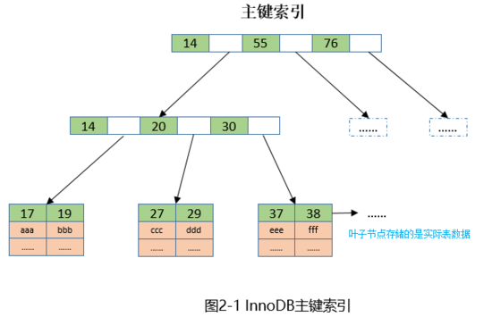

# java8-study

**********

# 基础知识

## 泛型

### 作用

**在编译时会有更强的类型检查**

**消除类型转换**

**可以实现更通用的算法**

### 泛型擦除

java的泛型是由编译器在编译时实行的，编译器内部永远把所有类型`T`视为`Object`处理，但是，在需要转型的时候，编译器会根据`T`的类型自动为我们实行安全地强制转型。

### 泛型局限性

**局限一**：`<T>`不能是基本类型，例如`int`，因为实际类型是`Object`，`Object`类型无法持有基本类型：

**局限二**：无法取得带泛型的`Class`。所有泛型实例，无论`T`的类型是什么，`getClass()`返回同一个`Class`实例，因为编译后它们全部都是`ArrayList<Object>`。

**局限三**：无法判断带泛型的类型：正是由于泛型时基于类型擦除实现的，所以，**泛型类型无法向上转型**。

## 代理

### 静态代理

在说动态代理前，还是先说说静态代理。所谓静态代理，就是通过声明一个明确的代理类来访问源对象。

~~~java
public class Student implements Person{

    private String name;

    public Student() {
    }

    public Student(String name) {
        this.name = name;
    }

    @Override
    public void wakeup() {
        System.out.println(StrUtil.format("学生[{}]早晨醒来啦",name));
    }

    @Override
    public void sleep() {
        System.out.println(StrUtil.format("学生[{}]晚上睡觉啦",name));
    }
~~~

**PersonProxy:**

```java
public class PersonProxy implements Person {

    private Person person;

    public PersonProxy(Person person) {
        this.person = person;
    }

    @Override
    public void wakeup() {
        System.out.println("早安~");
        person.wakeup();
    }

    @Override
    public void sleep() {
        System.out.println("晚安~");
        person.sleep();
    }
}
```

这种模式虽然好理解，但是缺点也很明显：

- 会存在大量的冗余的代理类，这里演示了2个接口，如果有10个接口，就必须定义10个代理类。
- 不易维护，一旦接口更改，代理类和目标类都需要更改。

### 动态代理

动态代理，通俗点说就是：无需声明式的创建java代理类，而是在运行过程中生成"虚拟"的代理类，被ClassLoader加载。从而避免了静态代理那样需要声明大量的代理类。

#### JDK动态代理

JDK从1.3版本就开始支持动态代理类的创建。主要核心类只有2个：`java.lang.reflect.Proxy`和`java.lang.reflect.InvocationHandler`。

可以看到，相对于静态代理类来说，无论有多少接口，这里只需要一个代理类。核心代码也很简单。唯一需要注意的点有以下2点：

- JDK动态代理是需要声明接口的，创建一个动态代理类必须得给这个”虚拟“的类一个接口。可以看到，这时候经动态代理类创造之后的每个bean已经不是原来那个对象了。

- 为什么这里`JdkProxy`还需要构造传入原有的bean呢？因为处理完附加的功能外，需要执行原有bean的方法，以完成`代理`的职责。

  这里`JdkProxy`最核心的方法就是

  ```java
  public Object invoke(Object proxy, Method method, Object[] args) throws Throwable
  ```

  其中proxy为代理过之后的对象(并不是原对象)，method为被代理的方法，args为方法的参数。

  如果你不传原有的bean，直接用`method.invoke(proxy, args)`的话，那么就会陷入一个死循环。

#### cglib 动态代理

Spring在5.X之前默认的动态代理实现一直是jdk动态代理。但是从5.X开始，spring就开始默认使用Cglib来作为动态代理实现。并且springboot从2.X开始也转向了Cglib动态代理实现。

是什么导致了spring体系整体转投Cglib呢，jdk动态代理又有什么缺点呢？

Cglib是一个开源项目，它的底层是字节码处理框架ASM，Cglib提供了比jdk更为强大的动态代理。主要相比jdk动态代理的优势有：

- jdk动态代理只能基于接口，代理生成的对象只能赋值给接口变量，而Cglib就不存在这个问题，Cglib是通过生成子类来实现的，代理对象既可以赋值给实现类，又可以赋值给接口。
- Cglib速度比jdk动态代理更快，性能更好。

## 各种动态代理的性能如何

前面介绍了4种动态代理对于同一例子的实现。对于代理的模式可以分为2种：

- JDK动态代理采用接口代理的模式，代理对象只能赋值给接口，允许多个接口
- Cglib，Javassist，ByteBuddy这些都是采用了子类代理的模式，代理对象既可以赋值给接口，又可以复制给具体实现类

 

# 学习异步响应式编程

### HashMap数据结构

HashMap采用了数组+链表/红黑树数据结构，在链表长度大于8时升级为红黑树，小于六时退化为链表。避免频繁数据结构转换。

HashMap插入数据过程：

1. 判断数组是否为空，为空进行初始化。
2. 不为空，计算 k 的 hash 值，通过`(n - 1) & hash`计算应当存放在数组中的下标 index;
3. 查看 table[index] 是否存在数据，没有数据就构造一个Node节点存放在 table[index] 中；
4. 存在数据，说明发生了hashssz(存在二个节点key的hash值一样), 继续判断key是否相等，相等，用新的value替换原数据(onlyIfAbsent为false)；
5. 如果不相等，判断当前节点类型是不是树型节点，如果是树型节点，创造树型节点插入红黑树中；
6. 如果不是树型节点，创建普通Node加入链表中；判断链表长度是否大于 8， 大于的话链表转换为红黑树；
7. 插入完成之后判断当前节点数是否大于阈值，如果大于开始扩容为原数组的二倍。

**红黑树与平衡二叉树比较**

虽然平衡树解决了二叉查找树退化为近似链表的缺点，能够把查找时间控制在 O(logn)，不过却不是最佳的，因为平衡树要求每个节点的左子树和右子树的高度差至多等于1，这个要求实在是太严了，导致每次进行插入/删除节点的时候，几乎都会破坏平衡树的第二个规则，进而我们都需要通过左旋和右旋来进行调整，使之再次成为一颗符合要求的平衡树。

实际应用中，若搜索的次数远远大于插入和删除，那么选择AVL，如果搜索，插入删除次数几乎差不多，应该选择RB。

### CurrentHashMap

在JDK1.7版本中，ConcurrentHashMap的数据结构是由一个Segment数组和多个HashEntry组成，主要实现原理是实现了锁分离的思路解决了多线程的安全问题

JDK1.8的实现已经摒弃了Segment的概念，而是直接用Node数组+链表+红黑树的数据结构来实现，在锁的实现上，抛弃了原有的 Segment 分段锁，采用`CAS + synchronized`实现更加细粒度的锁。整个看起来就像是优化过且线程安全的HashMap，虽然在JDK1.8中还能看到Segment的数据结构，但是已经简化了属性，只是为了兼容旧版本。

将锁的级别控制在了更细粒度的哈希桶数组元素级别，也就是说只需要锁住这个链表头节点（红黑树的根节点），就不会影响其他的哈希桶数组元素的读写，大大提高了并发度。

> JDK1.8 中为什么使用内置锁 synchronized替换 可重入锁 ReentrantLock？

- 在 JDK1.6 中，对 synchronized 锁的实现引入了大量的优化，并且 synchronized 有多种锁状态，会从无锁 -> 偏向锁 -> 轻量级锁 -> 重量级锁一步步转换。
- 减少内存开销 。假设使用可重入锁来获得同步支持，那么每个节点都需要通过继承 AQS 来获得同步支持。但并不是每个节点都需要获得同步支持的，只有链表的头节点（红黑树的根节点）需要同步，这无疑带来了巨大内存浪费。

> ConcurrentHashMap 的 get 方法是否要加锁，为什么？

get 方法不需要加锁。因为 Node 的元素 value 和指针 next 是用 volatile 修饰的，在多线程环境下线程A修改节点的 value 或者新增节点的时候是对线程B可见的。

这也是它比其他并发集合比如 Hashtable、用 Collections.synchronizedMap()包装的 HashMap 效率高的原因之一。

> **JDK1.7 与 JDK1.8 中ConcurrentHashMap 的区别？**

- 数据结构：取消了 Segment 分段锁的数据结构，取而代之的是数组+链表+红黑树的结构。
- 保证线程安全机制：JDK1.7 采用 Segment 的分段锁机制实现线程安全，其中 Segment 继承自 ReentrantLock 。JDK1.8 采用`CAS+synchronized`保证线程安全。
- 锁的粒度：JDK1.7 是对需要进行数据操作的 Segment 加锁，JDK1.8 调整为对每个数组元素加锁（Node）。
- 链表转化为红黑树：定位节点的 hash 算法简化会带来弊端，hash 冲突加剧，因此在链表节点数量大于 8（且数据总量大于等于 64）时，会将链表转化为红黑树进行存储。
- 查询时间复杂度：从 JDK1.7的遍历链表O(n)， JDK1.8 变成遍历红黑树O(logN)


## Java延迟队列

**Timer**

JDK自带的定时器

存在schedule和scheduleAtFixedRate两套不同调度算法的方法， 它们的共同点是若判断理论执行时间小于实际执行时间时，都会马上执行任务，区别在于计算下一次执行时间的方式不同：

- schedule： 任务开始的时间 + period（时间片段），强调“固定间隔”地执行任务
- scheduleAtFixedRate： 参数设定开始的时间 + period（时间片段），强调“固定频率”地执行任务

可以看出前者采用实际值，后者采用理论值。不过实际上若参数设定的开始时间比当前时间大的话，两者执行的效果是一样的。

**缺点**

Timer被设计成支持多个定时任务，通过源码发现它有一个任务队列用来存放这些定时任务，并且启动了一个线程来处理。

通过这种单线程的方式实现，在存在多个定时任务的时候便会存在问题： 若任务B执行时间过长，将导致任务A延迟了启动时间！

还存在另外一个问题，应该是属于设计的问题： 若任务线程在执行队列中某个任务时，该任务抛出异常，将导致线程因跳出循环体而终止，即Timer停止了工作！


## NIO和BIO区别

**堆外内存优点**

1. 减少垃圾回收工作，因为垃圾回收会暂停其他工作。
2. 加快了复制速度，因为堆内在flush到远程时，会先复制到直接内存（非堆内存），然后在发送；而堆外内存相当于省略掉了这个工作。 福之祸所依，自然也有不好的一面。

**堆外内存缺点**

1. 堆外内存难以控制，如果内存泄漏，那么很难排查 
2. 堆外内存相对来说，不适合存储很复杂的对象。一般简单的对象或者扁平化的比较适合。

**由于堆外内存并不直接控制于JVM，因此只能等到full GC的时候才能垃圾回收！（direct buffer归属的的JAVA对象是在堆上且能够被GC回收的，一旦它被回收，JVM将释放direct buffer的堆外空间。前提是没有关闭**DisableExplicitGC**）**

**堆外内存回收方法**

堆外内存回收的几张方法：

1. Full GC，一般发生在年老代垃圾回收以及调用System.gc的时候，但这样不一顶能满足我们的需求。
2. 调用ByteBuffer的cleaner的clean()，内部还是调用System.gc(),所以一定不要**-XX:+DisableExplicitGC**

## Netty

**Netty业务设计**

Netty的ChannelHandler是业务代码和Netty框架交汇的地方，ChannelHandler里的业务逻辑，正常来说是由NioEventLoop（NIO）线程串行执行，以Netty服务端举例，在服务端接收到新消息后，第一步要做的往往是用解码的handler解码消息的字节序列，字节序列解码后就变为了消息对象，第二步将消息对象丢给后续的业务handler处理，**此时如果某个业务handler的流程非常耗时，比如需要查询数据库，那么为了避免I/O线程（也就是Netty的NIO线程）被长时间占用**，需要使用额外的非I/O线程池来执行这些耗时的业务逻辑，这也是基本操作。

看下NIO线程常见的阻塞情况，一共两大类：

- 无意识：在ChannelHandler中编写了可能导致NIO线程阻塞的代码，但是用户没有意识到，包括但不限于查询各种数据存储器的操作、第三方服务的远程调用、中间件服务的调用、等待锁等
- 有意识：用户知道有耗时逻辑需要额外处理，但是在处理过程中翻车了，比如主动切换耗时逻辑到业务线程池或者业务的消息队列做处理时发生阻塞，最典型的有对方是阻塞队列，锁竞争激烈导致耗时，或者投递异步任务给消息队列时异机房的网络耗时，或者任务队列满了导致等待，等等

EventLoopGroup： 本身一个线程池，每个EventLoop是一个线程，并且持有自己的NIO Selector 选择器。客户端持有一个EventLoopGroup处理网络IO操作。服务端持有两个EventLoopGroup，其中boss组专门用来接收客户端发来的TCP连接请求，worker组专门用来处理完成三次握手后的网络IO请求。

Netty中两大线程池：

- NioEventLoopGroup
- DefaultEventExecutorGroup

1. NioEventLoopGroup线程池内部是NioEventLoop，它可以理解为是I/O线程，它内部聚合了Java的Thread，以及JDK的I/O多路复用器，实现了事件循环机制，侧重于处理网络I/O相关的各种操作
2. DefaultEventExecutorGroup线程池内部是DefaultEventExecutor，它可以理解为是非I/O线程，内部聚合了Java的Thread，但没有I/O多路复用器，侧重于处理耗时业务逻辑（非I/O操作）
3. I/O线程池里的线程封装实例Thread会绑定I/O多路复用器，以及配套的NIO的属性，非I/O线程池的线程只封装Thread，类似于JDK原生的线程，很干净。
4. 非I/O线程池的线程执行器的执行原理和I/O线程池的线程执行器没什么区别，都可以统称为Netty线程，而且它们都消除了锁竞争。即每个Channel只会绑定一个不变的Netty线程，而一个Netty线程可以绑定多个Channel，期间每个Channel上的各种handler的逻辑执行都是串行无锁的。

它们和JDK线程池的区别

两者比起来，Netty线程池里的线程全部消除了对锁的竞争，而JDK的线程池没有这种设计，JDK线程池的线程会处理同一个阻塞队列。比如LinkedBlockingQueue，可能产生锁竞争。

### Channel和EventLoop关系

在netty中，NioEventLoop是EventLoop的一个实现，每个NioEventLoop会管理自己的Selector选择器和监听选择器就绪事件的线程。每个Channel在整个生命周期中固定关联到某一个EventLoop，但是每个NioEventLoop可以关联多个Channel。

### Netty 解码器Decoder、组合编解码器Codec

**HttpServerCodec **

- `HttpServerCodec`是netty针对http编解码的处理类，但是这些只能处理像http `get`的请求,也就是数据带在`url问号后面`的http请求

**HttpObjectAggregator**

这个netty的处理器把`HttpMessage`和`HttpContent`聚合成为一个`FullHttpRquest`或者`FullHttpRsponse`。


## SELECT、EPOLL模型

1. NIC（网卡） 接收到数据，通过 DMA 方式写入内存(Ring Buffer 和 sk_buff)。
2. NIC 发出中断请求（IRQ），告诉内核有新的数据过来了。
3. Linux 内核响应中断，系统切换为内核态，处理 Interrupt Handler，从RingBuffer 拿出一个 Packet， 并处理协议栈，填充 Socket 并交给用户进程。
4. 系统切换为用户态，用户进程处理数据内容。


为了防止硬中断过多，打断CPU执行计划。因此网卡使用了NAPI技术，硬中断转换为软中断，积累一批数据进行处理。

那软中断又是什么呢？我们知道在中断处理时CPU没法处理其它事物，对于网卡来说，如果每次网卡收包时中断的时间都过长，那很可能造成丢包的可能性。当然我们不能完全避免丢包的可能性，以太包的传输是没有100%保证的，所以网络才有协议栈，通过高层的协议来保证连续数据传输的数据完整性（比如在协议发现丢包时要求重传）。但是即使有协议保证，那我们也不能肆无忌惮的使用中断，中断的时间越短越好，尽快放开处理器，让它可以去响应下次中断甚至进行调度工作。基于这样的考虑，我们将中断分成了上下两部分，上半部分就是上面说的中断部分，需要快速及时响应，同时需要越快结束越好。而下半部分就是完成一些可以推后执行的工作。对于网卡收包来说，网卡收到数据包，通知内核数据包到了，中断处理将数据包存入内存这些都是急切需要完成的工作，放到上半部完成。而解析处理数据包的工作则可以放到下半部去执行。


- #### select （一次O(n)查找）

1. 每次传给内核一个用户空间分配的 fd_set 用于表示“关心的 socket”。其结构（相当于 bitset）限制了只能保存1024个 socket。

2. 每次 socket 状态变化，内核利用 fd_set 查询O(1)，就能知道监视进程是否关心这个 socket。

3. 内核是复用了 fd_set 作为出参，返还给监视进程（所以每次 select 入参需要重置）。

   然而监视进程必须遍历一遍 socket 数组O(n)，才知道哪些 socket 就绪了。
   
   内核需要将消息传递到用户空间，都需要内核拷贝动作。需要维护一个用来存放大量fd的数据结构，使得用户空间和内核空间在传递该结构时复制开销大。
   
   - 每次调用select，都需要把fd集合从用户态拷贝到内核态，这个开销在fd很多时会很大
   
   - 同时每次调用select都需要在内核遍历传递进来的所有fd，这个开销在fd很多时也很大
   
   - - select支持的文件描述符数量太小了，默认是1024

- #### poll （一次O(n)查找）

1. poll本质上和select没有区别，它将用户传入的数组拷贝到内核空间，然后查询每个fd对应的设备状态， **但是它没有最大连接数的限制**，原因是它是基于链表来存储的.

- #### epoll （全是O(1)查找）

1. 每次传给内核一个实例句柄。这个句柄是在内核分配的红黑树 rbr+双向链表 rdllist。只要句柄不变，内核就能复用上次计算的结果。

2. 每次 socket 状态变化，内核就可以快速从 rbr 查询O(1)，监视进程是否关心这个 socket。同时修改 rdllist，所以 rdllist 实际上是“就绪的 socket”的一个缓存。

3. 内核复制 rdllist 的一部分或者全部（LT 和 ET），到专门的 epoll_event 作为出参。

   所以监视进程，可以直接一个个处理数据，无需再遍历确认。**epoll可以理解为event poll**，不同于忙轮询和无差别轮询，epoll会把哪个流发生了怎样的I/O事件通知我们。所以我们说epoll实际上是**事件驱动（每个事件关联上fd）**的，此时我们对这些流的操作都是有意义的。**（复杂度降低到了O(1)）**

select，poll，epoll都是IO多路复用的机制。I/O多路复用就通过一种机制，可以监视多个描述符，一旦某个描述符就绪（一般是读就绪或者写就绪），能够通知程序进行相应的读写操作。但select，poll，epoll本质上都是同步I/O，因为他们都需要在读写事件就绪后自己负责进行读写，也就是说这个读写过程是阻塞的，而异步I/O则无需自己负责进行读写，异步I/O的实现会负责把数据从内核拷贝到用户空间。  

# Spring

## SpringBoot启动过程

1. 推断Web应用类型
2. 设置Bootstrapper、ApplicationContextInitializer、ApplicationListener
3. 推断main方法
4. 创建并配置环境Environment
5. 打印Banner
6. 创建并配置ApplicationContext
7. 刷新ApplicationContext（此处交由Spring处理，调用Spring的refresh()方法）实例化所有的bean
8. 回调所有的ApplicationRunner和CommandLineRunner

### Spring Bean 加载过程

首先加载配置类的后置处理器, 将其解析后放入到beanDefinitionMap中. 然后加载配置类, 也将其解析后放入beanDefinitionMap中. 最后解析配置类. 我们这里直接简化掉前两步, 将两个类放入beanDefinitionMap中. 主要模拟第三步解析配置类. 在解析的过程中, 获取bean的时候会出现循环依赖的问题循环依赖。

在@Autowired的时候, 增加了一个出口. 判断即将要创建的类是否已经存在, 如果存在了, 那么就直接返回, 不在创建。

虽然使用了一级缓存解决了循环依赖的问题, 但要是在多线程下, 这个依赖可能就会出现问题.

比如: 有两个线程, 同时创建instanceA 和instanceB, instanceA和instanceB都引用了instanceC. 他们同步进行, 都去创建instanceC. 首先A去创建, A在实例化instanceC以后就将其放入到一级缓存了, 这时候, B去一级缓存里拿. 此时拿到的instanceC是不完整的. 后面的属性赋值, 初始化都还没有执行呢. 所以, 我们增加二级缓存来解决这个问题. 

```
一级缓存: 解决循环依赖的问题
二级缓存: 在创建实例bean和放入到一级缓存之间还有一段间隙. 如果在这之间从一级缓存拿实例, 肯定是返回null的. 为了避免这个问题, 增加了二级缓存.
```

```
面试题: 在创建bean的时候, 在哪里创建的动态代理, 这个应该怎么回答呢?
很多人会说在初始化之后, 或者在实例化之后.
其实更严谨的说, 有两种情况: 第一种是在初始化之后调用 . 第二种是出现了循环依赖, 会在实例化之后调用
```

三级缓存的作用:

**一级缓存:** 用来存放成熟的bean. 这个bean如果是切入点, 则是一个动态代理的bean,如果不是切入点, 则是一个普通的类

**二级缓存:** 用来存放循环依赖过程中创建的动态代理bean. 

**三级缓存:** 用来存放动态代理的钩子方法. 用来在需要构建动态代理类的时候使用.

**Spring IOC**

**控制反转，依赖注入**

当对象创建的太多的时候，就会出现一个对象更改，就得更改所有依赖它的对象，耦合性大。 **自主性体现的同时也出现了对象耦合严重的情况** 。我们在用的时候直接拿到这个对象去用，而将创建对象的能力交给第三方，这样我们就不需要关心对象是怎么创建的了。即将自己的控制权交出去。 **这就是控制反转**

 **对象怎么才能直接被我们拿来用呢** 。对象创建的时候，我们把这个对象注入到这个对象中，然后就可以使用了。 

**这就是依赖注入**

**完成这些工作的就是IOC容器，它帮助我们创建对象，然后在对象被使用的时候，将对象注入到这个对象中。而由于IOC创建对象是通过反射来创建的，所以其速度不如直接new对象**

**初始化Bean**

spring中支持3种初始化bean的方法：

- xml中指定init-method方法
- 使用@PostConstruct注解
- 实现InitializingBean接口

先后顺序： PostConstruct、InitializingBean、init-method

### FactoryBean与BeanFactory

说起 `FactoryBean` 就不得不提 `BeanFactory` 

- BeanFactory：spring容器的顶级接口，管理bean的工厂。
- FactoryBean：并非普通的工厂bean，它隐藏了实例化一些复杂Bean的细节，给上层应用带来了便利。

## Spring 动态代理Cglib

cglib与动态代理最大的**区别**就是

- 使用动态代理的对象必须实现一个或多个接口
- 使用cglib代理的对象则无需实现接口，达到代理类无侵入。

cglib代理无需实现接口，通过生成类字节码实现代理，比反射稍快，不存在性能问题，但cglib会继承目标对象，需要重写方法，所以目标对象不能为final类。

**Spring autowired 和resource注解区别**

​	@Resource的作用相当于@Autowired，只不过@Autowired按byType自动注入，而@Resource默认按 byName自动注入罢了。@Resource有两个属性是比较重要的，分是name和type，Spring将@Resource注解的name属性解析为bean的名字，而type属性则解析为bean的类型。所以如果使用name属性，则使用byName的自动注入策略，而使用type属性时则使用byType自动注入策略。如果既不指定name也不指定type属性，这时将通过反射机制使用byName自动注入策略。

**SpringBoot加载配置文件**

可放置目录(优先级从高到低)

```bash
1. ./config/ (当前项目路径config目录下); 
2. ./ (当前项目路径下); 
3. classpath:/config/ (类路径config目录下); 
4. classpath:/ (类路径config下).
```

SpringBoot会从这四个位置全部加载配置文件并互补配置；

**Configuration 和ConfigurationProperty注解**

**@ConfigurationProperties与@Value两种注解对比**

| 比较项                    | @ConfigurationProperties | @Value |
| :------------------------ | :----------------------- | :----- |
| 全量注入                  | 支持                     | 不支持 |
| 松散绑定(Relaxed Binding) | 支持                     | 不支持 |
| SpEL                      | 不支持                   | 支持   |
| JSR303                    | 支持                     | 不支持 |

松散绑定：驼峰命名(userName)、横干拼接(user-name)、下划线（user_name）之间可以互相识别绑定称为做松散绑定 

JSR303：通过@Email，@Nullable，@Digits 等等注解进行邮箱、判空、数字格式等等数据的校验

@ConfigurationProperties通常用于将配置全量注入某个类中； @Value通常用于注入某一些特定配置值中；

**单例模式和静态类区别**

单例模式是面向对象的设计。本质上还是创建对象，调用方法。单例存在的根本就是为了得到对象。

静态类是单纯使用方法体，对象没有存在的价值。所以直接使用类名调用，不创建对象。静态类存在是为了快捷方便的使用里面的方法。

## Spring中拦截器和过滤器的区别

1. 拦截器不依赖与servlet容器，是SpringMVC自带的，过滤器依赖于Servlet容器。
2. 拦截器是基于java的反射机制的，而过滤器是基于函数回调。
3. 拦截器只能对action请求起作用，而过滤器则可以对几乎所有的请求起作用。
4. 拦截器可以访问controller上下文、值栈里的对象，而过滤器不能访问。(拦截器的preHandle方法在进入controller前执行，而拦截器的postHandle方法在执行完controller业务流程后，在视图解析器解析ModelAndView之前执行，可以操控Controller的ModelAndView内容。而afterCompletion是在视图解析器解析渲染ModelAndView完成之后执行的)( 过滤器是在服务器启动时就会创建的，只会创建一个实例，常驻内存，也就是说服务器一启动就会执行Filter的init(FilterConfig config)方法.当Filter被移除或服务器正常关闭时，会执行destroy方法)
5. **拦截器可以获取IOC容器中的各个bean，而过滤器就不行**，这点很重要，在拦截器里注入一个service，可以调用业务逻辑。(关于这句话的解读是：我们知道拦截器是SprinMVC自带的，而SpringMVC存在Controller层的，而controller层可以访问到service层，service层是不能访问service层的，而过滤器是客户端和服务端之间请求与响应的过滤)
6. 过滤器和拦截器触发时机、时间、地方不一样。(过滤器是在请求进入容器后，但请求进入servlet之前进行预处理的。请求结束返回也是在servlet处理完后，返回给前端之前,如果看不懂可以看7完后再来理解)
7. 过滤器包裹住servlet，servlet包裹住拦截器。

### 拦截器

在Web开发中，我们经常会用到拦截器。而常用用于实现拦截的有：Filter、HandlerInterceptor、MethodInterceptor。我们也简单了解一下他们的区别：

- Filter是Servlet规范规定的，不属于spring框架，也是用于请求的拦截。我们在写Filter时需要自己配置拦截的urlPatterns,它适合更粗粒度的拦截，在请求前后做一些编解码处理、Session验证等。
- HandlerInterceptoer拦截的是请求地址，功能能跟Filter类似，但是提供更精细的的控制能力：在request被响应之前、request被响应之后、视图渲染之前以及request全部结束之后。所以针对请求地址做一些验证、预处理等操作比较合适。也可以用作计算一个请求的相应时间等。【必须过DispatcherServlet的请求才会被拦截】
- MethodInterceptor利用的是AOP的实现机制，它拦截的目标是方法，即使不是controller中的方法。实现MethodInterceptor拦截器大致也分为两种，一种是实现MethodInterceptor接口，另一种利用AspectJ的注解或配置。

拦截器中HandlerInterceptoer拦截后无法重写Request，因此Request中Body读取后无法再次被Controller中读取，无法实现对Body的校验，Filter可以重写Request后传入。

## Spring Starter 自动加载机制

1. Spring Boot在启动时扫描项目所依赖的JAR包，寻找包含`spring.factories`文件的JAR包，
2. 然后读取`spring.factories`文件获取配置的自动配置类AutoConfiguration`，
3. 然后将自动配置类下满足条件(`@ConditionalOnXxx`)的@Bean放入到Spring容器中(Spring Context)
4. 这样使用者就可以直接用来注入，因为该类已经在容器中了

## Spring注解

### @Transaction

失效条件：

- 同一个类中，事务方法为初始，则调用该类中其他不含有事务方法事务生效，如果是不含有事务方法调用事务方法则不生效，同一个类中事务是否开启会采取入口的设置。
- 不同类方法调用

| A类a方法 | 调用 | B类b方法 | 调用 | B类c方法 |                                                  |
| -------- | ---- | -------- | ---- | -------- | :----------------------------------------------- |
| 有事务   |      | 没事务   |      | 没事务   | a方法b方法c方法事务生效，且在同一个事务中        |
| 没有事务 |      | 有事务   |      | 没事务   | b方法c方法事务生效，且在同一个事务,a方法没有事务 |
| 没有事务 |      | 没有事务 |      | 有事务   | a方法b方法c方法事务均不生效                      |

- 多实例多线程中事务的影响

1. 某一个实例的事务中如果插入表或者更新表，则在当前事务中再次查询是执行后的结果，而其他实例或者线程则读取的还是未修改的结果

- 异常

事务方法中抛出RuntimeException和Error时才会生效

事务异常回滚不会回滚对变量的修改

 **@Transactional 生效的条件**

- 除非特殊配置（比如使用 AspectJ 静态织入实现 AOP），否则只有定义在 public 方法上的 @Transactional 才能生效。原因是，Spring 默认通过动态代理的方式实现 AOP，对目标方法进行增强，private/protected 方法无法代理到，Spring 自然也无法动态增强事务处理逻辑。
- 必须通过代理过的类从外部调用目标方法才能生效


# HttpClient

**ConnectionRequestTimeout**

httpclient使用连接池来管理连接，这个时间就是从连接池获取连接的超时时间，可以想象下数据库连接池

**ConnectTimeout**

连接建立时间，三次握手完成时间

首先需要添加apache httpclient依赖

```
<dependency>
    <groupId>org.apache.httpcomponents</groupId>
    <artifactId>httpclient</artifactId>
    <version>4.5.12</version>
</dependency>
<dependency>
    <groupId>org.apache.httpcomponents</groupId>
    <artifactId>httpcore</artifactId>
    <version>4.4.13</version>
</dependency>
```

然后新建httpclient类：

在dopost中可以根据业务自定义逻辑

```java
@Slf4j
@Service
public class HttpClientFactory {
    @Autowired
    HttpClientConfig httpClientConfig;

    private PoolingHttpClientConnectionManager poolConnManager;

    // 线程安全，所有的线程都可以使用它一起发送http请求
    private CloseableHttpClient httpClient;

    @PostConstruct
    public void init() {
        try {
            log.info("init http client start, default config is {}", httpClientConfig);
            SSLConnectionSocketFactory trustAll = buildSSLContext();
            // 配置同时支持 HTTP 和 HTTPS
            // 一个httpClient对象对于https仅会选用一个SSLConnectionSocketFactory
            Registry<ConnectionSocketFactory> socketFactoryRegistry = RegistryBuilder.<ConnectionSocketFactory>create().
                    register("http", PlainConnectionSocketFactory.getSocketFactory()).
                    register("https", trustAll).build();
            // 初始化连接管理器
            poolConnManager = new PoolingHttpClientConnectionManager(socketFactoryRegistry);
            poolConnManager.setMaxTotal(httpClientConfig.getPollMaxTotal());// 同时最多连接数
            // 设置最大路由
            poolConnManager.setDefaultMaxPerRoute(httpClientConfig.getPollMaxPeerRouter());
            httpClient = getConnection();
            log.info("init http client finish");
        } catch (Exception e) {
            log.error("", e);
        }
    }

    public CloseableHttpClient getConnection() {

        RequestConfig config = RequestConfig.custom().setConnectTimeout(httpClientConfig.getConnectTimeout())
                .setConnectionRequestTimeout(httpClientConfig.getConnectionRequestTimeout())
                .setSocketTimeout(httpClientConfig.getResponseTimeout())
                .build();
        return HttpClients.custom()
                // 设置连接池管理
                .setConnectionManager(poolConnManager)
                .setDefaultRequestConfig(config).build();
    }

    public String doGet(String url) {
        return this.doGet(url, Collections.EMPTY_MAP, Collections.EMPTY_MAP);
    }

    public String doGet(String url, Map<String, Object> params) {
        return this.doGet(url, Collections.EMPTY_MAP, params);
    }

    public String doGet(String url, Map<String, String> headers, Map<String, Object> params) {

        // *) 构建GET请求头
        String apiUrl = getUrlWithParams(url, params);
        HttpGet httpGet = new HttpGet(apiUrl);

        // *) 设置header信息
        if (headers != null && headers.size() > 0) {
            for (Map.Entry<String, String> entry : headers.entrySet()) {
                httpGet.addHeader(entry.getKey(), entry.getValue());
            }
        }

        try (CloseableHttpResponse response = httpClient.execute(httpGet)) {
            if (response == null || response.getStatusLine() == null) {
                return null;
            }

            int statusCode = response.getStatusLine().getStatusCode();
            if (statusCode == HttpStatus.SC_OK) {
                HttpEntity entityRes = response.getEntity();
                if (entityRes != null) {
                    return EntityUtils.toString(entityRes, "UTF-8");
                }
            }
            return null;
        } catch (IOException e) {
            log.error("", e);

        }
        return null;
    }

    public HttpServerResponseDTO doPost(String apiUrl, String body, int connectionTimeOut, Integer contentTypeEnum, String pemBody) {
        return doPost(apiUrl, Collections.EMPTY_MAP, body, connectionTimeOut, contentTypeEnum);
    }

    public HttpServerResponseDTO doPost(String apiUrl, Map<String, String> headers, String body,Integer contentTypeEnum) {
        CloseableHttpClient currentHttpClient = httpClient;
        HttpPost httpPost = new HttpPost(apiUrl);
        // *) 配置请求headers
        if (headers != null && headers.size() > 0) {
            for (Map.Entry<String, String> entry : headers.entrySet()) {
                httpPost.addHeader(entry.getKey(), entry.getValue());
            }
        }
        ContentTypeEnum contentType = ContentTypeEnum.getDataSourceEnum(contentTypeEnum);
        // *) 配置请求参数
        httpPost.setEntity(new StringEntity(body, ContentType.create(contentType.getDesc(), Consts.UTF_8)));


        httpPost.setConfig(buildRequestConfig());
        try (CloseableHttpResponse response = currentHttpClient.execute(httpPost)) {
            if (response == null || response.getStatusLine() == null) {
                return HttpServerResponseDTO.builder()
                        .statusCode(Constants.HTTP_CLIENT_ERROR)
                        .build();
            }
            HttpEntity httpEntity = response.getEntity();
            String contentTypeString = httpEntity.getContentType() == null ? null : httpEntity.getContentType().getValue();
            String connection = getHeaderValue(response, "Connection");
            String server = getHeaderValue(response, "Server");
            String date = getHeaderValue(response, "Date");
            String pragma = getHeaderValue(response, "pragma");

            return HttpServerResponseDTO.builder()
                    .statusCode(response.getStatusLine().getStatusCode())
                    .body(EntityUtils.toString(response.getEntity(), UTF_8))
                    .contentType(contentTypeString)
                    .connection(connection)
                    .server(server)
                    .date(date)
                    .pragma(pragma)
                    .build();
        } catch (IOException e) {
            log.error("", e);
            return HttpServerResponseDTO.builder().statusCode(Constants.HTTP_CLIENT_ERROR).statusMessage(e.getMessage()).build();
        }
    }

    private String getUrlWithParams(String url, Map<String, Object> params) {
        boolean first = true;
        StringBuilder sb = new StringBuilder(url);
        for (String key : params.keySet()) {
            char ch = '&';
            if (first) {
                ch = '?';
                first = false;
            }
            String value = params.get(key).toString();
            try {
                String sval = URLEncoder.encode(value, "UTF-8");
                sb.append(ch).append(key).append("=").append(sval);
            } catch (UnsupportedEncodingException e) {
                log.error("", e);
            }
        }
        return sb.toString();
    }

    public SSLConnectionSocketFactory buildSSLContext() throws KeyStoreException, NoSuchAlgorithmException, CertificateException, UnrecoverableKeyException, KeyManagementException {

        SSLContext sslcontext = SSLContexts.custom()
                //忽略掉对服务器端证书的校验
                .loadTrustMaterial((TrustStrategy) (chain, authType) -> true)
                .build();

        return new SSLConnectionSocketFactory(
                sslcontext,
                new String[]{"TLSv1", "TLSv1.1", "TLSv1.2"},
                null,
                NoopHostnameVerifier.INSTANCE);
    }

    private RequestConfig buildRequestConfig() {
        int connectionOut = httpClientConfig.getConnectTimeout();
        return RequestConfig.custom().setConnectTimeout(connectionOut)
                .setConnectionRequestTimeout(httpClientConfig.getConnectionRequestTimeout())
                .setSocketTimeout(connectionOut)
                .build();
    }

    private String getHeaderValue(CloseableHttpResponse response, String key) {
        return response.getFirstHeader(key) == null ?
                null : response.getFirstHeader(key).getValue();
    }
}
```

调用方式：

```java
@Autowired
HttpClientFactory httpClientFactory;

HttpServerResponseDTO httpServerResponseDTO = httpClientFactory.doPost(url, headersMap, body, httpConfigEntity.getContentType(), httpConfigEntity.getTls());

```


# 多线程编程

## 线程安全

### 锁

(1) Synchronized(java自带的关键字)

(2) lock 可重入锁 (可重入锁这个包java.util.concurrent.locks 底下有两个接口，分别对应两个类实现了这个两个接口： 

​    (a)lock接口, 实现的类为：ReentrantLock类 可重入锁;

​    (b)readwritelock接口，实现类为：ReentrantReadWriteLock 读写锁)

也就是说有三种：

（1）synchronized 是互斥锁；

（2）ReentrantLock 顾名思义 ：可重入锁

（3）ReentrantReadWriteLock :读写锁

Synchronized缺点： 1. 无法控制阻塞时长。2. 阻塞无法被中断。

总结来说，Lock和synchronized有以下几点不同：

1）Lock是一个接口，而synchronized是Java中的关键字，synchronized是内置的语言实现；
2）当synchronized块结束时，会自动释放锁，lock一般需要在finally中自己释放。synchronized在发生异常时，会自动释放线程占有的锁，因此不会导致死锁现象发生；而Lock在发生异常时，如果没有主动通过unLock()去释放锁，则很可能造成死锁现象，因此使用Lock时需要在finally块中释放锁；
3）lock等待锁过程中可以用interrupt来中断等待，而synchronized只能等待锁的释放，不能响应中断。
4）lock可以通过trylock来知道有没有获取锁，而synchronized不能；

CountDownLatch、CyclicBarrier、Sempahore 多线程并发三大利器

CountDownLatch： 当做一个计数器来使用,比如某线程需要等待其他几个线程都执行过某个时间节点后才能继续执行。

CyclicBarrier：所有线程在其他线程没有准备好之前都在被阻塞中,等到所有线程都准备好了才继续执行 我们在创建CyclicBarrier对象时传入了一个方法,当调用CyclicBarrier的await方法后,当前线程会被阻塞等到所有线程都调用了await方法后 调用传入CyclicBarrier的方法,然后让所有的被阻塞的线程一起运行。

CountdownLatch和CyclicBarrier的区别
1、CountDownLatch简单的说就是一个线程等待，直到他所等待的其他线程都执行完成并且调用countDown()方法发出通知后，当前线程才可以继续执行。
2、CyclicBarrier是所有线程都进行等待，直到所有线程都准备好进入await()方法之后，所有线程同时开始执行！
3、CountDownLatch的计数器只能使用一次。而CyclicBarrier的计数器可以使用reset() 方法重置。所以CyclicBarrier能处理更为复杂的业务场景，比如如果计算发生错误，可以重置计数器，并让线程们重新执行一次。

Semaphore 就是一个共享锁，通过设置 state 变量来实现对这个变量的共享。当调用 acquire 方法的时候，state 变量就减去一，当调用 release 方法的时候，state 变量就加一。当 state 变量为 0 的时候，别的线程就不能进入代码块了，就会在 AQS 中阻塞等待。

### 读写锁

ReadWriteLock： 多线程同时读，只允许一个线程在写。 写线程具有排他性。

悲观锁，读的时候不允许写入。

StampedLock: Java8新锁，读的过程允许写锁后写入，需要额外逻辑判断读的过程中是否有写入（版本号）。一旦有写入，使用悲观锁重读一遍，是乐观锁。提升性能。

## CAS：Compare And Swap

**CAS** 全称是 compare and swap，是一种用于在多线程环境下实现同步功能的机制。 `CAS` 操作包含三个操作数 ：内存位置、预期数值和新值。 `CAS` 的实现逻辑是将内存位置处的数值与预期数值相比较，若相等，则将内存位置处的值替换为新值。若不相等，则不做任何操作,这个操作是个原子性操作，java里面的 `AtomicInteger` 等类都是通过cas来实现的。

 


## 线程状态

线程生命周期：

- NEW
- RUNNABLE
- RUNNING
- BLOCKED
- TERMINATE


> 当因为获取不到锁而无法进入同步块时，线程处于 BLOCKED 状态。

如果有线程长时间处于 BLOCKED 状态，要考虑是否发生了**死锁**（deadlock）的状况。

BLOCKED 状态可以视作为一种特殊的 waiting，是传统 waiting 状态的一个细分：


**Sleep和Wait两者的区别**

（1）属于不同的两个类，sleep()方法是线程类（Thread）的静态方法，wait()方法是Object类里的方法。

（2）sleep()方法不会释放锁，wait()方法释放对象锁。

（3）sleep()方法可以在任何地方使用，wait()方法则只能在同步方法或同步块中使用。

（4）sleep()必须捕获异常，wait()方法、notify()方法和notiftAll()方法不需要捕获异常。

（5）sleep()使线程进入阻塞状态（线程睡眠），wait()方法使线程进入等待队列（线程挂起），也就是阻塞类别不同。

  (6) 它们都可以被interrupted方法中断。

wait(1000)与sleep(1000)的区别

**Thread.Sleep(1000) **

意思是在未来的1000毫秒内本线程不参与CPU竞争，1000毫秒过去之后，这时候也许另外一个线程正在使用CPU，那么这时候操作系统是不会重新分配CPU的，直到那个线程挂起或结束。

即使这个时候恰巧轮到操作系统进行CPU 分配，那么当前线程也不一定就是总优先级最高的那个，CPU还是可能被其他线程抢占去。

另外值得一提的是Thread.Sleep(0)的作用，就是触发操作系统立刻重新进行一次CPU竞争，竞争的结果也许是当前线程仍然获得CPU控制权，也许会换成别的线程获得CPU控制权。

**wait(1000)**

表示将锁释放1000毫秒，到时间后如果锁没有被其他线程占用，则再次得到锁，然后wait方法结束，执行后面的代码，如果锁被其他线程占用，则等待其他线程释放锁。

注意，设置了超时时间的wait方法一旦过了超时时间，并不需要其他线程执行notify也能自动解除阻塞，但是如果没设置超时时间的wait方法必须等待其他线程执行notify。

线程三种状态区别：

（1）WAITING：进入等待状态，方式：wait/join/park方法进入无限等待，通过notify/notifyAll/unpark唤醒；

（2）TIMED_WAITING：与WAITING类似，方式：a. 给定等待时间的wait/join/park方法；b. sleep方法；

（3）BLOCKED：被动进入等待状态，方式：进入Synchronized块；


### 线程安全Violate

​	如果一个变量在多个CPU中都存在缓存（一般在多线程编程时才会出现），那么就可能存在缓存不一致的问题 。

缓存不一致的通用解决办法：

- 总线加#Lock锁。
- 通过缓存一致性协议。

Java 内存模型规定所有的变量都是存在主存当中（类似于前面说的物理内存），每个线程都有自己的工作内存（类似于前面的高速缓存）。线程对变量的所有操作都必须在工作内存中进行，而不能直接对主存进行操作。并且每个线程不能访问其他线程的工作内存。

并发程序正确地执行， **必须要保证原子性、可见性以及有序性** 。

volatile 关键字禁止指令重排序有两层意思：

- 当程序执行到 volatile 变量的读操作或者写操作时，在其前面的操作的更改肯定全部已经进行，且结果已经对后面的操作可见；在其后面的操作肯定还没有进行；
- 在进行指令优化时，不能将在对 volatile 变量访问的语句放在其后面执行，也不能把 volatile 变量后面的语句放到其前面执行。

观察加入 volatile 关键字和没有加入 volatile 关键字时所生成的汇编代码发现，加入 volatile 关键字时，会多出一个 lock 前缀指令。

- 它确保指令重排序时不会把其后面的指令排到内存屏障之前的位置，也不会把前面的指令排到内存屏障的后面；即在执行到内存屏障这句指令时，在它前面的操作已经全部完成；
- 它会强制将对缓存的修改操作立即写入主存；
- 如果是写操作，它会导致其他 CPU 中对应的缓存行无效。

### 线程变量 ThreadLocal

存入到ThreadLocal中的数据事实上是存储在ThreadLocalMap的Entry中。

在threadlocal的生命周期中,都存在这些引用. 看下图: 实线代表强引用,虚线代表弱引用


> 图中，ThreadLocalMap维护一个Entry的数组，所以一个线程可以有多个ThreadLocal实例。


## 线程池

### 线程池拒绝策略

- ThreadPoolExecutor.AbortPolicy:丢弃任务并抛出RejectedExecutionException异常。
- ThreadPoolExecutor.DiscardPolicy：丢弃任务，但是不抛出异常。
- ThreadPoolExecutor.DiscardOldestPolicy：丢弃队列最前面的任务，然后重新提交被拒绝的任务
- ThreadPoolExecutor.CallerRunsPolicy：由调用线程（提交任务的线程）处理该任务

### 线程池状态

ThreadPoolExecutor线程池有5个状态，分别是：

1. RUNNING：可以接受新的任务，也可以处理阻塞队列里的任务
2. SHUTDOWN：不接受新的任务，但是可以处理阻塞队列里的任务
3. STOP：不接受新的任务，不处理阻塞队列里的任务，中断正在处理的任务
4. TIDYING：过渡状态，也就是说所有的任务都执行完了，当前线程池已经没有有效的线程，这个时候线程池的状态将会TIDYING，并且将要调用terminated方法
5. TERMINATED：终止状态。terminated方法调用完成以后的状态

### 线程池队列策略

- ArrayBlockingQueue：在ArrayBlockingQueue实现中，take()和put()用的是统一的一个单锁。
- LinkedBlockingQueue：在LinkedBlockingQueue类的实现中，是对put()和take()分别使用了两个不同的锁，都使用了ReentrantLock实现。
- SynchronousQueue：SynchronousQueue的特点是，读取操作take()和放入操作put()同时完成才会同时解开阻塞,即一个元素只有当其本身被take()的时候put()才会被唤醒。没有容量的概念。

# JMM

Java 的对象可以分为基本数据类型和普通对象。

对于普通对象来说，JVM 会首先在堆上创建对象，然后在其他地方使用的其实是它的引用。比如，把这个引用保存在虚拟机栈的局部变量表中。

对于基本数据类型来说（byte、short、int、long、float、double、char)，有两种情况。

我们上面提到，每个线程拥有一个虚拟机栈。当你在方法体内声明了基本数据类型的对象，它就会在栈上直接分配。其他情况，通常在在堆上分配，逃逸分析的情况下可能会在栈分配。

注意，像 int[] 数组这样的内容，是在堆上分配的。数组并不是基本数据类型。.

从抽象角度看，JMM 定义了线程与主内存之间的抽象关系：

1. 线程之间的共享变量存储在主内存（Main Memory）中；
2. 每个线程都有一个私有的本地内存（Local Memory），本地内存是 JMM 的一个抽象概念，并不真实存在，它涵盖了缓存、写缓冲区、寄存器以及其他的硬件和编译器优化。本地内存中存储了该线程以读/写共享变量的拷贝副本。
3. 从更低的层次来说，主内存就是硬件的内存，而为了获取更好的运行速度，虚拟机及硬件系统可能会让工作内存优先存储于寄存器和高速缓存中。
4. Java 内存模型中的线程的工作内存（working memory）是 cpu 的寄存器和高速缓存的抽象描述。而 JVM 的静态内存储模型（JVM 内存模型）只是一种对内存的物理划分而已，它只局限在内存，而且只局限在 JVM 的内存。

**内存屏障：内存可见性与指令重排序**

那 JMM 如何保障指令重排序排序，内存可见性带来并发访问问题？

内存屏障（Memory Barrier）用于控制在特定条件下的重排序和内存可见性问题。JMM 内存屏障可分为读屏障和写屏障，Java 的内存屏障实际上也是上述两种的组合，完成一系列的屏障和数据同步功能。**Java 编译器在生成字节码时，会在执行指令序列的适当位置插入内存屏障来限制处理器的重排序**。

组合如下：

- Load-Load Barriers：load1 的加载优先于 load2 以及所有后续的加载指令，在指令前插入 Load Barrier，使得高速缓存中的数据失效，强制重新从驻内存中加载数据。
- Load-Store Barriers：确保 load1 数据的加载先于 store2 以及之后的存储指令刷新到内存。
- Store-Store Barriers：确保 store1 数据对其他处理器可见，并且先于 store2 以及所有后续的存储指令。在 Store Barrie 指令后插入 Store Barrie 会把写入缓存的最新数据刷新到主内存，使得其他线程可见。
- Store-Load Barriers：在 Load2 及后续所有读取操作执行前，保证 Store1 的写入对所有处理器可见。这条内存屏障指令是一个全能型的屏障，它同时具有其他 3 条屏障的效果，而且它的开销也是四种屏障中最大的一个。

JMM 是一个抽象概念，由于 CPU 多核多级缓存、为了优化代码会发生指令重排的原因，JMM 为了屏蔽细节，定义了一套规范，保证最终的并发安全。它抽象出了工作内存于主内存的概念，并且**通过八个原子操作以及内存屏障保证了原子性、内存可见性、防止指令重排**，使得 volatile 能保证内存可见性并防止指令重排、synchronised 保证了内存可见性、原子性、防止指令重排导致的线程安全问题，JMM 是并发编程的基础。

并且 JMM 为程序中所有的操作定义了一个关系，称之为 「Happens-Before」原则，要保证执行操作 B 的线程看到操作 A 的结果，那么 A、B 之间必须满足「Happens-Before」关系，如果这两个操作缺乏这个关系，那么 JVM 可以任意重排序。

**Happens-Before**

- 程序顺序原则：如果程序操作 A 在操作 B 之前，那么多线程中的操作依然是 A 在 B 之前执行。
- 监视器锁原则：在监视器锁上的解锁操作必须在同一个监视器上的加锁操作之前执行。
- volatile 变量原则：对 volatile 修饰的变量写入操作必须在该变量的读操作之前执行。
- 线程启动原则：在线程对 Tread.start 调用必须在该线程执行任何操作之前执行。
- 线程结束原则：线程的任何操作必须在其他线程检测到该线程结束前执行，或者从 Thread.join 中成功返回，或者在调用 Thread.isAlive 返回 false。
- 中断原则：当一个线程在另一个线程上调用 interrupt 时，必须在被中断线程检测到 interrupt 调用之前执行。
- 终结器规则：对象的构造方法必须在启动对象的终结器之前完成。
- 传递性：如果操作 A 在操作 B 之前执行，并且操作 B 在操作 C 之前执行，那么操作 A 必须在操作 C 之前执行。

# JVM

## 内存布局


### Heap 堆区

-X指的是JVM运行参数，`ms` 是memory start的简称，代表的是`最小堆容量`，`mx`是memory max的简称，代表的是最大堆容量

### Metaspace 元空间

 在JDK8版本中，元空间的前身`Pern`区已经被淘汰。在JDK7及之前的版本中，`Hotspot`还有`Pern`区，翻译为永久代，在启动时就已经确定了大小，难以进行调优，并且只有`FGC`时会移动类元信息。不同于之前版本的`Pern`（永久代），JDK8的`元空间`已经在`本地内存`中进行分配，并且，`Pern`区中的所有内容中`字符串常量`移至`堆内存`，其他内容也包括了`类元信息`、`字段`、`静态属性`、`方法`、`常量`等等都移至`元空间`内。

### JVM Stacks 虚拟机栈

 栈（Stack）是一个`先进后出`的数据结构。 相对于基于寄存器的运行环境来说，JVM是基于`栈结构`的运行环境。因为栈结构移植性更好，可控性更强。JVM的虚拟机栈是描述Java方法执行的内存区域，并且是`线程私有`的。`栈中的元素用于支持虚拟机进行方法调用，每个方法从开始调用到执行完成的过程，就是栈帧从入帧到出帧的过程`。在活动线程中，只有位于栈顶的帧才是有效的，称为`当前栈帧`。正在执行的方法称为`当前方法`，栈帧是方法运行的基本结构。在执行引擎运行时，所有指令都只能针对当前栈帧进行操作。而StackOverflowError表示请求的栈溢出，导致内存耗尽，通常出现在递归方法中。如果把`JVM`当做一个棋盘，`虚拟机栈`就是棋盘上的将/帅，`当前方法的栈帧`就是棋子能走的区域，而`操作栈`就是每一个棋子。操作栈的压栈和出栈如下图所示：


 虚拟机栈通过`压栈`和`出栈`的方式，对每个方法对应的活动栈帧进行运算处理，方法正常执行结束，肯定会跳转到另外一个栈帧上。在执行的过程中，如果出现异常，会进行异常回溯，返回地址通过异常处理表确定。栈帧在整个JVM体系中的地位颇高，包括`局部变量表`、`操作栈`、`动态连接`、`方法返回地址`等。

### Native Method Stacks（本地方法栈）

 本地方法栈（Native Method Stack）在JVM内存布局中，也是`线程对象私有`的，但是虚拟机栈“主内”，而本地方法栈“主外”。这个“内外”是针对JVM来说的，本地方法栈为`Native方法`服务。线程开始调用本地方法时，会进入一个不再受JVM约束的世界。本地方法可以通过`JVNI`（Java Native Interface）来访问虚拟机运行时的数据区，甚至可以调用寄存器，具有和JVM相同的能力和权限。当大量本地方法出现时，势必会削弱JVM对系统的控制力，因为它的出错信息都比较黑盒，难以捉摸。对于内存不足的情况，本地方法栈还是会抛出 `native heap OutOfMemory`。

 重点说下JNI类本地方法，最常用的本地方法应该是`System.currentTimeMills()`，`JNI`使Java深度使用操作系统的特性功能，复用非Java代码。但是在项目过程中，如果大量使用其他语言来实现`JNI`，就会丧失跨平台特性，威胁到程序运行的稳定性。假如需要与本地代码交互，就可以用中间标准框架来进行解耦，这样即使本地方法崩溃也不至于影响到`JVM`的稳定。

### Program Counter Register （程序计数寄存器）

 在程序计数寄存器（Program Counter Register，PC）中，Register的命名源于CPU的寄存器，`CPU只有把数据装载到寄存器才能够运行`。寄存器存储指令相关的现场信息，由于CPU时间片轮限制，众多线程在并发执行过程中，任何一个确定的时刻，一个处理器或者多核处理器中的一个内核，只会执行某个线程中的一个指令。这样必然会导致经常中断或恢复，如何才能保证分毫无差呢？每个线程在创建之后，都会产生自己的`程序计数器`和`栈帧`，`程序计数器`用来存放`执行指令的偏移量和行号指示器等`，线程执行或恢复都要依赖`程序计数器`。`程序计数器在各个线程之间互不影响，此区域也不会发生内存溢出异常`。

## 小结

最后，从线程的角度来看，堆和元空间是所有线程共享的，而虚拟机栈、本地方法栈、程序计数器是线程内部私有的，我们以线程的角度再来看看Java的内存结构图：


## JVM 类加载器

### 双亲委派机制

缺陷：**JDK核心库**中提供了很多SPI（Service Provider Interface），常见的SPI包括JDBC、JCE、JNDI和JBI等，**JDK只规定了这些接口之间的逻辑关系**。但不提供具体实现。问题在于java.lang.sql中所有接口都是由**JDK提供**，加载这些接口的类加载器是**根加载器**，第三方厂商提供的驱动则由系统类加载器加载。第三方JDBC驱动包中的实现不会被加载。

Java使用JDBC这个SPI完全透明了应用程序和第三方厂商数据库驱动的具体实现。不管数据库类型如何切换，只需要替换JDBC的驱动Jar和数据库动态名称即可。

### JVM内置三大类加载器

#### Bootstrap ClassLoader

根类加载器，无父类加载器，C++编写，加载虚拟机核心库。如java.lang包下所有类。

#### Ext ClassLoader

扩展类加载器，父类为根加载器，主要加载Jre\lib\ext下类库。Java语言实现。

#### Application ClassLoader

系统类加载器，负责加载classpath下的类库资源，例如引入的三方jar包。

#### 自定义类加载器

#### 线程上下文类加载器

如果没有设置，与父线程保持同样的类加载器。

**getContextClassLoader() setContextClassLoader用于获取和设置当前线程的上下文类加载器。**

#### 数据库驱动初始化

所有JDBC驱动程序，首先调用Class.forName（“xxxx.xxxx.Driver”）加载数据库驱动。

1. 首先获取线程上下文类加载器，通常是系统类加载器。
2. 通过递归DriverManager中已经注册的驱动类，验证是否可以在指定的类加载器中加载（线程上下文类加载器），如果通过返回Connection，此时返回的为数据库厂商提供的实例。

由于JDK定义了SPI标准接口，根加载器

# 数据库

## Mybatis

java.util.Date实际上是能够表示MySQL的三种字段类型

1. date
2. datetime
3. timestamp

tinyint(1)tinyint(2)tinyint(3)tinyint(4)在平时工作中括号 里面的值设置多少无所谓,取值范围都是相同的,工作中很少会使用补零的情况,所以直接使用tinyint(1)就完事了.2. 对于int也是同理,大家都喜欢用int(11),统统int(11)就行,反正取值范围都是相同的

### MyBatis的实现逻辑

1. 在 MyBatis 的初始化过程中，会生成一个 Configuration 全局配置对象，里面包含了所有初始化过程中生成对象
2. 根据 Configuration 创建一个 SqlSessionFactory 对象，用于创建 SqlSession “会话”
3. 通过 SqlSession 可以获取到 Mapper 接口对应的动态代理对象，去执行数据库的相关操作
4. 动态代理对象执行数据库的操作，由 SqlSession 执行相应的方法，在他的内部调用 Executor 执行器去执行数据库的相关操作
5. 在 Executor 执行器中，会进行相应的处理，将数据库执行结果返回

## Mysql

### 事务

- 原子性（atomicity，或称不可分割性）

一个事务（transaction）中的所有操作，或者全部完成，或者全部不完成，不会结束在中间某个环节。

- 一致性（consistency）

在事务开始之前和事务结束以后，数据库的完整性没有被破坏。例如：对银行转帐事务，不管事务成功还是失败，应该保证事务结束后ACCOUNT表中aaa和bbb的存款总额为2000元。

- 隔离性（isolation，又称独立性）

数据库允许多个并发事务同时对其数据进行读写和修改的能力，隔离性可以防止多个事务并发执行时由于交叉执行而导致数据的不一致。

- 持久性（durability）

事务处理结束后，对数据的修改就是永久的，即便系统故障也不会丢失。


| **隔离级别**              | **脏读** | **丢失更新** | **不可重复读** | **幻读** | **并发模型** | **更新冲突检测** |
| ------------------------- | -------- | ------------ | -------------- | -------- | ------------ | ---------------- |
| 未提交读：Read Uncommited | 是       | 是           | 是             | 是       | 悲观         | 否               |
| 已提交读：Read commited   | 否       | 是           | 是             | 是       | 悲观         | 否               |
| 可重复读：Repeatable Read | 否       | 否           | 否             | 是       | 悲观         | 否               |
| 可串行读：Serializable    | 否       | 否           | 否             | 否       | 悲观         | 否               |


### Mysql 执行逻辑

通过Mysql的架构分层，我们首先就可以很清晰的了解到一个SQL的大概的执行过程。

1. 首先客户端发送请求到服务端，建立连接。
2. 服务端先看下查询缓存是否命中，命中就直接返回，否则继续往下执行。
3. 接着来到解析器，进行语法分析，一些系统关键字校验，校验语法是否合规。
4. 然后优化器进行SQL优化，比如怎么选择索引之类，然后生成执行计划。
5. 最后执行引擎调用存储引擎API查询数据，返回结果。

### Mysql 索引

MySQL 索引分为 **主键索引** (或聚簇索引)和 **二级索引** (或非主键索引、非聚簇索引、辅助索引，包括各种主键索引外的其他所有索引)。不同存储引擎对于数据的组织方式略有不同。

**通过非主键（辅助索引）查询商品数据的过程**

如果用商品编码查询商品（即使用辅助索引进行查询），会先检索辅助索引中的 B+Tree 的 商品编码，找到对应的叶子节点，获取**主键值**，然后再通过主键索引中的 B+Tree 树查询到对应的叶子节点，然后获取整行数据。 **这个过程叫回表** 。

对InnoDB而言，主键索引和数据是存放在一起的，构成一颗B+树(称为索引组织表)，**主键位于非叶子节点，数据存放于叶子节点**。示意图如下：



而MyISAM是堆组织表，主键索引和数据分开存放，叶子节点保存的只是数据的物理地址，示意图如下：


二级索引的组织方式对于InnoDB和MyISAM是一样的，保存了二级索引和主键索引的对应关系，**二级索引列位于非叶子节点，主键值位于叶子节点**，示意图如下：


以select * from t where name='aaa'为例，MySQL Server对sql进行解析后发现name字段有索引可用，于是先在二级索引上根据name='aaa'找到主键id=17，然后根据主键17到主键索引上上找到需要的记录。

当我们用树的结构来存储索引的时候，访问一个节点就要跟磁盘之间发生一次 IO。 InnoDB 操作磁盘的最小的单位是一页(或者叫一个磁盘块)。与主存不同，磁盘I/O存在机械运动耗费，因此磁盘I/O的时间消耗是巨大的。

#### B+ Tree优点

1. **B+树能够减少 I/O 的次数**

单个节点就代表了一个磁盘块，而单个磁盘块的大小是固定的。B+树仅有叶子结点才存储值，相对于所有节点都存完整数据的B树而言，B+树中单个磁盘块能够容纳更多的数据。一次 I/O 能够把更多的数据加载进内存，而这些多加载的元素很可能是你会用到的，而这就一定程度上能减少 I/O 的次数。除此之外，单个节点能够存储的元素增多了，还能够起到减少树的高度的作用。

2. **查询效率更加稳定**

因为B+树非叶子结点不会存储数据，所以如果要获取到最终的数据，必然会查到叶子结点，换句话说，每次查询的 I/O 次数是相同的。而B树由于所有节点均可存储数据，有的数据可能1次 I/O 就查询到了，而有的则需要查询到叶子结点才找到数据，而这就会带来查询效率的不稳定。

3. **能够更好的支持范围查询**

#### B+Tree 相对于 B 树 索引结构的优势

B+Tree 只在叶子节点存储数据，而 B 树 的非叶子节点也要存储数据，所以 B+Tree 的单个节点的数据量更小，在相同的磁盘 I/O 次数下，就能查询更多的节点。

另外，B+Tree 叶子节点采用的是双链表连接，适合 MySQL 中常见的基于范围的顺序查找，而 B 树无法做到这一点。

#### B+Tree 相对于二叉树索引结构的优势

对于有 N 个叶子节点的 B+Tree，其搜索复杂度为O(logdN)，其中 d 表示节点允许的最大子节点个数为 d 个。

在实际的应用当中， d 值是大于100的，这样就保证了，即使数据达到千万级别时，B+Tree 的高度依然维持在 3~4 层左右，也就是说一次数据查询操作只需要做 3~4 次的磁盘 I/O 操作就能查询到目标数据（这里的查询参考上面 B+Tree 的聚簇索引的查询过程）。

而二叉树的每个父节点的儿子节点个数只能是 2 个，意味着其搜索复杂度为 O(logN)，这已经比 B+Tree 高出不少，因此二叉树检索到目标数据所经历的磁盘 I/O 次数要更多。

#### B+Tree 相对于 Hash 表存储结构的优势

我们知道范围查询是 MySQL 中常见的场景，但是 Hash 表不适合做范围查询，它更适合做等值的查询，这也是 B+Tree 索引要比 Hash 表索引有着更广泛的适用场景的原因。

至此，你就知道“为什么 MySQL 会选择 B+Tree 来做索引”了。在回答时，你要着眼于 B+Tree 的优势，然后再引入索引原理的查询过程（掌握这些知识点，这个问题其实比较容易回答）。

通过执行计划查看索引使用详情 我这里有一张存储商品信息的演示表 product：

```mysql
CREATE TABLE `product`  (
  `id` int(11) NOT NULL,
  `product_no` varchar(20)  DEFAULT NULL,
  `name` varchar(255) DEFAULT NULL,
  `price` decimal(10, 2) DEFAULT NULL,
  PRIMARY KEY (`id`) USING BTREE,
  KEY 'index_name' ('name').
  KEY 'index_id_name' ('id', 'name')
) CHARACTER SET = utf8 COLLATE = utf8_general_ci
```

表中包含了主键索引、name 字段上的普通索引，以及 id 和 name 两个字段的联合索引。现在我们来看一条简单查询语句的执行计划：


#### 联合索引

联合索引也是非聚簇索引的一种，对联合索引新建 A,B,C 列字段索引，会生成 （A），（A,B），（A，B，C）三种索引。同样缺点就是联合索引会带来不小的索引开销。

联合索引遵循最左匹配原则。联合索引的B+数排列中叶子节点也按照索引顺序存放。


如图所示，非主键索引最底层叶子节点存放主键的值。如果全部值都可以从索引获取，则不需要走主键。

为什么非聚集索引存储主键的值？

- 保持一致性，当数据库表进行DML操作时，同一行记录的页地址会发生改变，因非主键索引保存的是主键的值，无需进行更改
- 节省存储空间，后续补充，不太清楚原因

### 自增锁

- 传统模式： 多个插入语句只能单条insert逐个执行。会使用 `AUTO-INC` 自增锁
- 批量模式（默认）： 预留空间，可以并行插入。但是像Insert INTO ... SELECT ....还是会获取自增锁。
- 交叉模式（8.0版本）：使用轻量Mutex锁，多个Insert并发执行。副作用是Insert的自增值不连续。BinLog的Insert顺序无法保障，导致主从之间同行数据主键ID不同。修改方式（MySQL 将日志存储格式从 `Statement` 变成了 `Row`）

## Mysql redo undo 日志

### Mysql Redo 日志

重做日志(redo log)用来保证事务的持久性，即事务ACID中的D。实际上它可以分为以下两种类型：

- 物理Redo日志
- 逻辑Redo日志

在InnoDB存储引擎中，**大部分情况下 Redo是物理日志，记录的是数据页的物理变化**。而逻辑Redo日志，不是记录页面的实际修改，而是记录修改页面的一类操作，比如新建数据页时，需要记录逻辑日志。关于逻辑Redo日志涉及更加底层的内容，这里我们只需要记住绝大数情况下，Redo是物理日志即可，DML对页的修改操作，均需要记录Redo

Redo写入时机

- 在数据页修改完成之后，在脏页刷出磁盘之前，写入redo日志。注意的是先修改数据，后写日志
- **redo日志比数据页先写回磁盘**
- 聚集索引、二级索引、undo页面的修改，均需要记录Redo日志。

### Mysql undo log

undo log主要记录的是数据的逻辑变化，为了在发生错误时回滚之前的操作，需要将之前的操作都记录下来，然后在发生错误时才可以回滚。

undo是一种逻辑日志，有两个作用：

- 用于事务的回滚
- MVCC

## LSM树

（Log Structured Merge Tree，结构化合并树），思想非常朴素，就是将对数据的修改增量保持在内存中，达到指定的大小限制后将这些修改操作批量写入磁盘（由此提升了写性能），是一种基于硬盘的数据结构，与B-tree相比，能显著地减少硬盘磁盘臂的开销。当然凡事有利有弊，LSM树和B+树相比，LSM树牺牲了部分读性能，用来大幅提高写性能。

读取时需要合并磁盘中的历史数据和内存中最近的修改操作,读取时可能需要先看是否命中内存，否则需要访问较多的磁盘文件（存储在磁盘中的是许多小批量数据，由此降低了部分读性能。但是磁盘中会定期做merge操作，合并成一棵大树，以优化读性能）。LSM树的优势在于有效地规避了磁盘随机写入问题，但读取时可能需要访问较多的磁盘文件。

## Redis

Redis为什么这么快？


### Redis五种数据结构

在 Redis 中，常用的 5 种数据类型和应用场景如下：

- String： 缓存、计数器、分布式锁等。
- List： 链表、队列、微博关注人时间轴列表等。
- Hash： 用户信息、Hash 表等。
- Set： 去重、赞、踩、共同好友等。
- Zset： 访问量排行榜、点击量排行榜等。

Redis底层数据结构


Redis有序集合zset与普通集合set非常相似，是一个没有重复元素的字符串集合。不同之处是有序集合的每个成员都关联了一个评分（score）,这个评分（score）被用来按照从最低分到最高分的方式排序集合中的成员。集合的成员是唯一的，但是评分可以是重复了 。

SortedSet(zset)是Redis提供的一个非常特别的数据结构，一方面它等价于Java的数据结构Map<String, Double>，可以给每一个元素value赋予一个权重score，另一方面它又类似于TreeSet，内部的元素会按照权重score进行排序，可以得到每个元素的名次，还可以通过score的范围来获取元素的列表。

**C语言字符串结构**


**SDS字符串结构**


相比于 C 语言来说，也就多了几个字段，分别用来标识空闲空间和当前数据长度，但简直是神来之笔：

- 可以 O(1)复杂度获取字符串长度；有 **len** 字段的存在，无需像 C 结构一样遍历计数。
- 杜绝缓存区溢出；C 字符串不记录已占用的长度，所以需要提前分配足够空间，一旦空间不够则会溢出。而有 **free** 字段的存在，让 SDS 在执行前可以判断并分配足够空间给程序
- 减少字符串修改带来的内存重分配次数；有 **free** 字段的存在，使 SDS 有了空间预分配和惰性释放的能力。
- 对二进制是安全的；二进制可能会有字符和 C 字符串结尾符 **'\0'** 冲突，在遍历和获取数据时产生截断异常，而 SDS 有了 **len** 字段，准确了标识了数据长度，不需担心被中间的 **'\0'** 截断。

Redis 在设计数据结构的时候出发点是一致的。总结起来就是一句话：空间换时间。

### Redis hash 字典

Redis 整体就是一个 哈希表来保存所有的键值对，无论数据类型是 5 种的任意一种。哈希表，本质就是一个数组，每个元素被叫做哈希桶，不管什么数据类型，每个桶里面的 entry 保存着实际具体值的指针。


整个数据库就是一个 全局哈希表 ，而哈希表的时间复杂度是 O(1)，只需要计算每个键的哈希值，便知道对应的哈希桶位置，定位桶里面的 entry 找到对应数据，这个也是 Redis 快的原因之一。

那 Hash 冲突怎么办？

当写入 Redis 的数据越来越多的时候，哈希冲突不可避免，会出现不同的 key 计算出一样的哈希值。

Redis 通过 链式哈希 解决冲突： 也就是同一个 桶里面的元素使用链表保存 。但是当链表过长就会导致查找性能变差可能，所以 Redis 为了追求快，使用了两个全局哈希表。用于 rehash 操作，增加现有的哈希桶数量，减少哈希冲突。

开始默认使用 hash 表 1 保存键值对数据，哈希表 2 此刻没有分配空间。当数据越来多触发 rehash 操作，则执行以下操作：

1. 给 hash 表 2 分配更大的空间；
2. 将 hash 表 1 的数据重新映射拷贝到 hash 表 2 中；
3. 释放 hash 表 1 的空间。

值得注意的是，将 hash 表 1 的数据重新映射到 hash 表 2 的过程中并不是一次性的，这样会造成 Redis 阻塞，无法提供服务。

而是采用了 渐进式 rehash ，每次处理客户端请求的时候，先从 hash 表 1 中第一个索引开始，将这个位置的 所有数据拷贝到 hash 表 2 中，就这样将 rehash 分散到多次请求过程中，避免耗时阻塞。

### Redis单线程

Redis 中，单线程的性能瓶颈主要在网络IO操作上。也就是在读写网络 read/write 系统调用执行期间会占用大部分 CPU 时间。如果你要对一些大的键值对进行删除操作的话，在短时间内是删不完的，那么对于单线程来说就会阻塞后边的操作。

**Reactor模式**

- 传统阻塞IO模型客户端与服务端线程1:1分配，不利于进行扩展。
- 伪异步IO模型采用线程池方式，但是底层仍然使用同步阻塞方式，限制了最大连接数。
- Reactor 通过 I/O复用程序监控客户端请求事件，通过任务分派器进行分发。

**单线程时代**

- 基于 Reactor 单线程模式实现，通过IO多路复用程序接收到用户的请求后，全部推送到一个队列里，交给文件分派器进行处理。

**多线程时代**

- 单线程性能瓶颈主要在网络IO上。
- 将网络数据读写和协议解析通过多线程的方式来处理 ，**对于命令执行来说，仍然使用单线程操作。**

单线程什么好处？

1. 不会因为线程创建导致的性能消耗；
2. 避免上下文切换引起的 CPU 消耗，没有多线程切换的开销；
3. 避免了线程之间的竞争问题，比如添加锁、释放锁、死锁等，不需要考虑各种锁问题。
4. 代码更清晰，处理逻辑简单。

单线程是否没有充分利用 CPU 资源呢？

因为 Redis 是基于内存的操作，CPU 不是 Redis 的瓶颈，Redis 的瓶颈最 有可能是机器内存的大小或者网络带宽 。既然单线程容易实现，而且 CPU 不会成为瓶颈，那就顺理成章地采用单线程的方案了。

Redis并没有在网络请求模块和数据操作模块中使用多线程模型，主要是基于以下四个原因：

- Redis 操作基于内存，绝大多数操作的性能瓶颈不在 CPU
- 使用单线程模型，可维护性更高，开发，调试和维护的成本更低
- 单线程模型，避免了线程间切换带来的性能开销
- 在单线程中使用多路复用 I/O技术也能提升Redis的I/O利用率

还是要记住：Redis并不是完全单线程的，只是有关键的网络IO和键值对读写是由一个线程完成的。

Redis 6.0采用多个IO线程来处理网络请求，网络请求的解析可以由其他线程完成，然后把解析后的请求交由主线程进行实际的内存读写。提升网络请求处理的并行度，进而提升整体性能。

但是，Redis 的多 IO 线程只是用来处理网络请求的，对于读写命令，Redis 仍然使用单线程来处理。

### Epoll IO多路复用

它的基本原理是，内核不是监视应用程序本身的连接，而是监视应用程序的文件描述符。

当客户端运行时，它将生成具有不同事件类型的套接字。在服务器端，I / O 多路复用程序（I / O 多路复用模块）会将消息放入队列（也就是 下图的 I/O 多路复用程序的 socket 队列），然后通过文件事件分派器将其转发到不同的事件处理器。

简单来说：Redis 单线程情况下，内核会一直监听 socket 上的连接请求或者数据请求，一旦有请求到达就交给 Redis 线程处理，这就实现了一个 Redis 线程处理多个 IO 流的效果。

select/epoll 提供了基于事件的回调机制，即针对不同事件的发生，调用相应的事件处理器。所以 Redis 一直在处理事件，提升 Redis 的响应性能。


Redis 线程不会阻塞在某一个特定的监听或已连接套接字上，也就是说，不会阻塞在某一个特定的客户端请求处理上。正因为此，Redis 可以同时和多个客户端连接并处理请求，从而提升并发性。

### Redis 缓存雪崩、缓存穿透和缓存击穿

- 缓存穿透：指缓存和数据库中都没有的数据，而用户不断发起请求，会导致数据库压力过大，严重会击垮数据库。

- 缓存雪崩： 同一时间大量的Key失效。
- 缓存击穿： 热点Key失效瞬间，持续的大并发就穿破缓存。

防止缓存穿透策略：

- 对参数进行校验，不合法参数直接返回。
- 对Redis和缓存都未取到的数据同样缓存为null
- Redis布隆过滤器判断Key是否存在库中

防止缓存击穿策略：

- 设置热点数据永远不过期
- 加上互斥锁

### Redis集群模式

1. Redis Sentinal 着眼于高可用，在 master 宕机时会自动将 slave 提升为master，继续提供服务。
2. Redis Cluster 着眼于扩展性，在单个 redis 内存不足时，使用 Cluster 进行分片存储。

哨兵实际上一共有三个任务：监控(Monitoring)、提醒(Notification)、自动故障迁移(Automatic failover)。

- 监控：Sentinel实例会不断检测主从节点是否正常运行。
- 提醒：当某个节点出现异常宕机时，Sentinel实例会向管理员或者其他应用发送提醒。
- 自动故障迁移：当主节点宕机时，Sentinel实例会将该主节点下的其中一个从节点升级为新的主节点，并且原先其他从节点重新发起socket请求成为新的主节点的从节点。
- 配置中心：向客户端返回新主节点的地址，就可以正常上使用新的主节点来处理请求了。

#### 哨兵模式

哨兵检测到主节点宕机一般有两种状态：sdown(主观宕机)和odown(客观宕机)。如果只有一个哨兵认为这个主节点宕机了，则成为主观宕机。如果达到一定数量的节点认为该主节点宕机，则成为客观宕机。

**为什么至少需要3个Sentinel实例？**

刚才说过了，当指定时间内指定哨兵数量都认为主节点宕机则称为客观宕机。那指定数量是多少呢？这个指定数量实际上等于哨兵数量 / 2 + 1.也就是说如果哨兵数量等于2，出现一个哨兵宕机的情况，在需要主从切换的时候因为无法达到认为主节点宕机的哨兵数量为2，所以在主节点出现宕机时无法进行主从切换。所以说部署哨兵至少需要3个Sentinel实例来保证健壮性。

**哨兵模式引发数据丢失问题**

哨兵模式 + Redis主从复制这种部署结构，无法保证数据不会出现丢失。哨兵模式下数据丢失主要有两种情况：

- 因为主从复制是异步操作，可能主从复制还没成功，主节点宕机了。这时候还没成功复制的数据就会丢失了。
- 如果主节点无法与其他从节点连接，但是实际上还在运行。这时候哨兵会将一个从节点切换成新的主节点，但是在这个过程中实际上主节点还在运行，所以继续向这个主节点写入的数据会被丢失。

#### Cluster模式

主从切换是指某个master不可用时，它的其中一个从节点升级为master的操作。

**通过投票机制来判断master是否不可用，参与投票的是所有的master，所有的master之间维持着心跳**，如果一半以上的master确定某个master失联，则集群认为该master挂掉，此时发生主从切换。

通过选举机制来确定哪一个从节点升级为master。选举的依据依次是：网络连接正常->5秒内回复过INFO命令->10*down-after-milliseconds内与主连接过的->从服务器优先级->复制偏移量->运行id较小的。选出之后通过slaveif no ont将该从服务器升为新master。

通过配置文件参数【cluster-node-timeout】指定心跳超时时间，默认是15秒。


在以下3种情况下，集群会不可用：

1. 某个master和其slave同时失联。
2. 某个master失联，并且其无slave。
3. 超过半数的master同时失联。

### Redis分布式锁

利用SETNX命令， Set If Not eXists。A: SETNX lock 1 成功返回1。 B： SETNX lock 1. 失败返回0。 操作完成后使用DEL释放锁。

问题： 容易出现锁不释放，由于线程问题或者进程突然挂掉。

解决方案：对锁设置超时时间。

问题：SETNX lock 1 ttl 10 是两条原子操作，无法保证设置有效期一定成功。

解决方案：Redis 2.6.12版本后提供SET lock 1 EX 10 NX。 一条命令的原子操作。

问题： 存在锁过期（客户端1操作太久超时自动释放）。2. 客户端1操作共享资源完成后，却又释放客户端2的锁。

1.  预估锁最长时间，
2. 客户端在加锁时，设置一个只有自己知道的「唯一标识」进去。SET lock $uuid EX 20 NX。在释放锁时，要先判断这把锁是否还归自己持有。写成LUA脚本，单线程执行完整个脚本。

 ### Redis AOF和RDB

#### AOF 

Redis AOF 写策略： 先执行 后记录日志。


优点： 执行成功才会记录日志。

存在问题：1. 记日志失败。 2.可能会阻塞下一个命令的执行。

 AOF 配置项 appendfsync 的三个可选值：


AOF重写机制：

AOF 重写机制就是在重写时，Redis 根据数据库的现状创建一个新的 AOF 文件，也就是说，读取数据库中的所有键值对，然后对每一个键值对用一条命令记录它的写入。和 AOF 日志由主线程写回不同，重写过程是由后台子进程 bgrewriteaof 来完成的，这也是为了避免阻塞主线程，导致数据库性能下降。


#### RDB

Redis 提供了两个命令来生成 RDB 文件，分别是 save 和 bgsave。

　　save：在主线程中执行，会导致阻塞；

　　bgsave：创建一个子进程，专门用于写入 RDB 文件，避免了主线程的阻塞，这也是 Redis RDB 文件生成的默认配置。

好了，这个时候，我们就可以通过 bgsave 命令来执行全量快照，这既提供了数据的可靠性保证，也避免了对 Redis 的性能影响。

为了快照而暂停写操作，肯定是不能接受的。所以这个时候，Redis 就会借助操作系统提供的写时复制技术（Copy-On-Write, COW），在执行快照的同时，正常处理写操作。

此时，如果主线程对这些数据也都是读操作（例如图中的键值对 A），那么，主线程和 bgsave 子进程相互不影响。但是，如果主线程要修改一块数据（例如图中的键值对 C），那么，这块数据就会被复制一份，生成该数据的副本（键值对 C’）。然后，主线程在这个数据副本上进行修改。同时，bgsave 子进程可以继续把原来的数据（键值对 C）写入 RDB 文件。


# Linux

linux 内核通过睡眠队列来组织所有等待某个事件的 task，而 wakeup 机制则可以异步唤醒整个睡眠队列上的 task，wakeup 逻辑在唤醒睡眠队列时，会遍历该队列链表上的每一个节点，调用每一个节点的 callback，从而唤醒睡眠队列上的每个 task。这样，在一个 connect 到达这个 lisent socket 的时候，内核会唤醒所有睡眠在 accept 队列上的 task。N 个 task 进程(线程)同时从 accept 返回，但是，只有一个 task 返回这个 connect 的 fd，其他 task 都返回-1(EAGAIN)。这是典型的 accept"惊群"现象。

在 linux 2.6 以后的内核，用户进程 task 对 listen socket 进行 accept 操作，如果这个时候如果没有新的 connect 请求过来，用户进程 task 会阻塞睡眠在 listent fd 的睡眠队列上。这个时候，用户进程 Task 会被设置 WQ_FLAG_EXCLUSIVE 标志位，并加入到 listen socket 的睡眠队列尾部(这里要确保所有不带 WQ_FLAG_EXCLUSIVE 标志位的 non-exclusive waiters 排在带 WQ_FLAG_EXCLUSIVE 标志位的 exclusive waiters 前面)。根据前面的唤醒逻辑，一个新的 connect 到来，内核只会唤醒一个用户进程 task 就会退出唤醒过程，从而不存在了"惊群"现象。

为提高服务器的并发处理能力，我们一般会使用 select/poll/epoll I/O 多路复用技术，同时为了充分利用多核 CPU，服务器上会起多个进程(线程)同时提供服务。于是，在某一时刻多个进程(线程)	阻塞在 select/poll/epoll_wait 系统调用上，当一个请求上来的时候，多个进程都会被 select/poll/epoll_wait 唤醒去 accept，然而只有一个进程(线程 accept 成功，其他进程(线程 accept 失败，然后重新阻塞在 select/poll/epoll_wait 系统调用上。可见，尽管 accept 不存在"惊群"，但是我们还是没能摆脱"惊群"的命运。只让一个进程去监听 listen socket 的可读事件，这样就可以避免"惊群"。